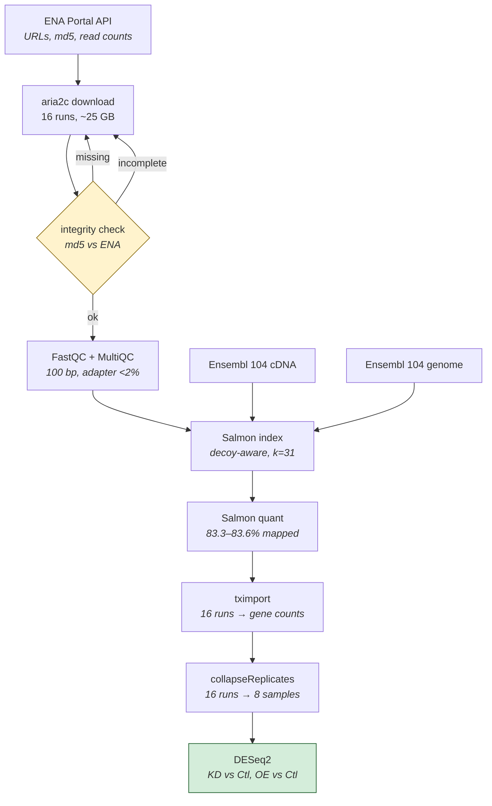

# Bulk RNA-seq — training project

Learning the upstream bulk RNA-seq workflow end to end: ENA retrieval →
QC → transcript-level quantification → gene-level differential expression.

Reproducing a published dataset (GSE50499) so that results can be checked
against the original findings rather than merely "looking plausible".

## Pipeline



## Dataset

- **Accession**: GSE50499 (SRA study: SRP029367)
- **Design**: 8 biological samples, single-end 100 bp, sequenced in technical
  duplicate (16 runs). Three groups: MOV10 knockdown (n=2), MOV10
  overexpression (n=3), irrelevant siRNA control (n=3).
- **Retrieval**: FASTQ files pulled directly from ENA rather than converted from
  SRA — no format conversion, and ENA checksums apply to the downloaded files.
- **Integrity**: each file verified against the ENA md5; the check script
  distinguishes missing, incomplete and corrupted files and applies the
  matching repair (fresh download vs. resume), then re-verifies.
- **Reference**: Ensembl release 104, GRCh38 — cDNA (transcriptome) and
  primary assembly (genome), same release for identifier consistency.
- **Index**: Salmon 2.0 decoy-aware, k=31. The genome is included as decoy
  sequence so that reads of intronic or genomic origin are discarded rather
  than forced onto the most similar transcript.
- **Rationale**: the knockdown/overexpression design provides a two-directional
  positive control — MOV10 must come out down in KD and up in OE, or the
  pipeline is wrong.

## Workflow

| Step | Script | Environment | Status | Checkpoint |
|------|--------|-------------|--------|------------|
| Metadata & URLs | `scripts/00_metadata.sh` | base | done | 16 runs in report |
| Download | `scripts/01_download.sh` | `fastq_download` | done | 16/16 files present |
| Integrity check | `scripts/02_check.sh` | base | done | 16/16 md5 match ENA |
| QC | `scripts/03_qc.sh` | `qc` | done | 100 bp, adapter <2% |
| Index + quantification | `scripts/04_salmon_quasimapping.sh` | `salmon` | done | 83.3–83.6% mapped |
| Differential expression | `scripts/05_de.R` | `deg` | not started | MOV10 down in KD, up in OE |

Technical duplicates are quantified per run and collapsed to 8 biological
samples in the DE step, not merged at the FASTQ level — this preserves
inter-run correlation as a QC check.

## Reproducing

```bash
conda env create -f envs/fastq_download.yml
conda env create -f envs/qc.yml
conda env create -f envs/salmon.yml

./scripts/00_metadata.sh
./scripts/01_download.sh                        # ~25 GB, not tracked in git
./scripts/02_check.sh && ./scripts/03_qc.sh
./scripts/04_salmon_quasimapping.sh             # index ~25 min, quant ~2 min/run
```

Each script exits non-zero on failure, so steps can be chained with `&&`
without risking a downstream step running on bad data.

## Environment

Developed on WSL2 (Ubuntu), 8 cores. Salmon 2.0 (Rust) builds the decoy-aware
index with external sorting and peaks at ~6 GB RSS, so the 15 GB WSL default
is sufficient.

Scripts set `LC_ALL=C` for consistent `sort` order and decimal parsing.

## Notes

Methodological decisions, including approaches that were tried and
abandoned, are logged in `DECISIONS.md`.

Raw data, reference files and Salmon indices are gitignored;
`meta/` contains everything needed to regenerate them.

## Status

Work in progress — this is a learning repository, not a validated pipeline.